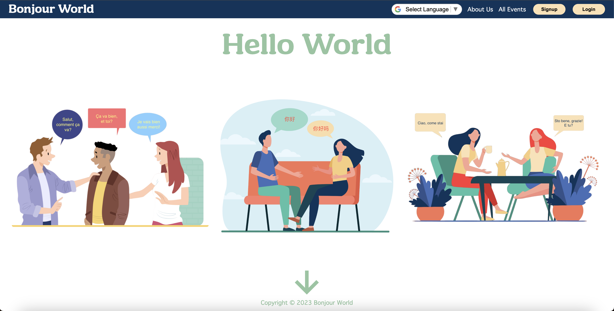

# Bonjour World - Language Exchange Platform

Visit our live site at [Bonjour World](https://bonjourworld.onrender.com/) to explore the world of language exchange events.



## Introduction

Welcome to Bonjour World, the ultimate language exchange hosting platform for language enthusiasts. Our platform brings together people from diverse backgrounds who share a passion for learning and practicing new languages. Whether you're a seasoned polyglot or just starting your language-learning journey, Bonjour World is the place to connect, practice, and make new friends.

## Technologies Used

- **MERN Stack**
- **Google Maps API**
- **Geocoding API**
- **Places API**
- **Google Translate API**

       

## Core Features

### 1. Customized Dynamic Maps with Google Maps API

We leverage the power of the Google Maps API along with the Geocoding and Places API to create an interactive and dynamic map that showcases language exchange events worldwide.


### Geocoding with Google Maps API

The `getAddressCoordinates` function in the Bonjour World project utilizes the Google Maps Geocoding API to convert a human-readable address into geographical coordinates (latitude and longitude). This function is particularly useful for plotting events on the map based on their addresses.

```javascript
const getAddressCoordinates = async (address) => {
  try {
    // Construct the Geocoding API URL
    const apiUrl = `https://maps.googleapis.com/maps/api/geocode/json?address=${encodeURIComponent(
      address
    )}&key=${process.env.REACT_APP_MAPS_API_KEY}`;

    // Fetch the Geocoding API data
    const response = await fetch(apiUrl);
    const data = await response.json();

    // Extract latitude and longitude if results are found
    if (data.results.length > 0) {
      const location = data.results[0].geometry.location;
      const latitude = location.lat;
      const longitude = location.lng;
      
      // Return a LatLng object using the Google Maps API
      return new window.google.maps.LatLng(latitude, longitude);
    } else {
      // Throw an error if no results are found
      throw new Error("No results found for the provided address.");
    }
  } catch (error) {
    // Log and re-throw the error to handle it in the calling code
    console.error("Error:", error);
    throw error;
  }
};
```

* The function takes an address as a parameter and constructs a URL for the Geocoding API request, including the address and the API key.
* A fetch request is made to the API, and the response is parsed as JSON.
* If the API returns results, the function extracts the latitude and longitude from the first result and creates a LatLng object using the Google Maps API.
* If no results are found, an error is thrown with an appropriate message.

### Creating a Marker for an Event

The following code snippet demonstrates how the Bonjour World project creates markers on the map for events using the Google Maps API. The `getAddressCoordinates` function is utilized to obtain the geographical coordinates based on the event's address.

```javascript
const formattedAddress = event.address;
const position = await getAddressCoordinates(formattedAddress);

if (!markersRef.current || !markersRef.current[event._id]) {
  // If no marker exists for the event, create one
  const marker = new window.google.maps.Marker({
    position,
    map,
    icon: {
      url: image,
      scaledSize: new window.google.maps.Size(40, 40),
    },
    optimized: false,
    disableAutoPan: true,
    animation: window.google.maps.Animation.DROP,
  });
}
```
* The formattedAddress variable holds the address of the event.
* The getAddressCoordinates function is called to obtain the geographical coordinates (position) based on the formatted address.
* If no marker exists for the event (based on its unique identifier), a new marker is created using the Google Maps API.
* The marker is customized with an icon, size, animation, and other properties to enhance the visual representation on the map.


**Challenges Faced:**
- **Integration Complexity:** Integrating multiple Google APIs for a seamless map experience posed a challenge in terms of complexity and ensuring a smooth user experience.
- **Real-time Updates:** Achieving real-time updates on the map for ongoing events required careful consideration of event handling and data synchronization.

### 2. Event Hosting and Joining Process
  #### Join Request API Endpoint

  - **Host Events:** Users can easily host language exchange events, setting the location, time, and language preferences.
  - **Join Requests:** Language enthusiasts can send join requests to event hosts, and hosts can seamlessly accept or decline requests.


```javascript
// POST /api/events/:id/users/:id (create a join request)
router.post('/:eventId/users/:userId', async (req, res, next) => {
    try {
        const user = await User.findById(req.params.userId);
        const event = await Event.findById(req.params.eventId);

        if (!user || !event) {
            return res.json({ message: 'User or Event not found' });
        }

        // Check if the user has not already requested or joined the event
        if (
            !user.requestedEvents.includes(event._id) &&
            !event.pendingAttendees.includes(user._id) &&
            !user.events.includes(event._id) &&
            !event.attendees.includes(user._id)
        ) {
            // Add the user to the requested events list and the event to the pending attendees list
            user.requestedEvents.push(req.params.eventId);
            event.pendingAttendees.push(req.params.userId);
            await user.save();
            await event.save();
        } else {
            // If the user has already requested or joined the event, return an error
            const error = new Error('User has already requested to join this event');
            error.statusCode = 400;
            error.errors = { message: 'User has already requested to join this event' };
            return next(error);
        }

        // Return the updated user and event information
        return res.json({ user: user, event: event });
    } catch (error) {
        // Handle errors related to event or user not found
        const error = new Error('Event or User not found');
        error.statusCode = 404;
        error.errors = { message: 'No event or user found with that id' };
        return next(error);
    }
});
```

* The API endpoint is a ```POST``` request to  ```/api/events/:id/users/:id```, fetching the user and event based on provided IDs.
* It checks if the user or event doesn't exist and returns a response if they are not found.
* The code then ensures the user hasn't already requested or joined the event before proceeding.
* If conditions are met, the user is added to the requested events list, and the event is added to the pending attendees list.
* If the user has already requested or joined, an error is returned.
* Finally, the updated user and event information are returned in the response.


**Challenges Faced:**
- **User Interaction Flow:** Designing an intuitive and user-friendly flow for event creation and join requests required careful consideration of user experience and platform usability.
  
## User Profiles

### Personalized Profiles

Every user has a dynamic profile that can be edited at any time. The profile showcases the user's past language exchange events and the connections they've made during these experiences.

## Conclusion

### Features in Development:

* Our team is actively working on a live messaging interface. This upcoming feature will enable users to practice their chosen language with other profiles in real-time. Stay tuned for an even more engaging language learning experience!

### Join us! 

We appreciate your support and feedback as we continue to refine and expand the Bonjour World platform. Join us on this language-learning journey, where connecting with others is as easy as saying "Bonjour"!


